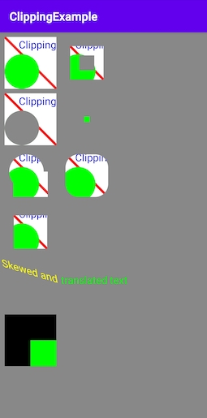

#  :art: Define regions of an image - ClippingExample

This is a toy app from Lesson 5 of the Advanced Android Apps with Kotlin course on [Udacity](https://www.udacity.com/).

## :barber: ClippingExample App

ClippingExample is an app that shows how to reduce Overdraw and get a smooth performance.

This application display how to properly use:

- Canvas
- Clipping
- Avoid Overdraw
- Different Shapes involved

## :camera_flash: Screenshots

